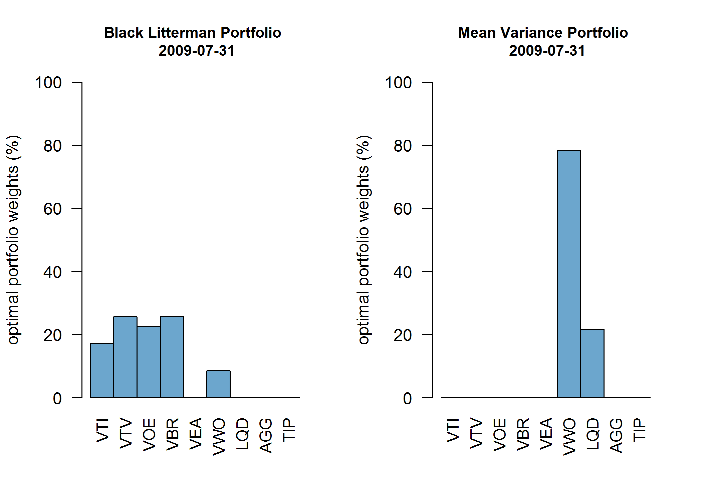
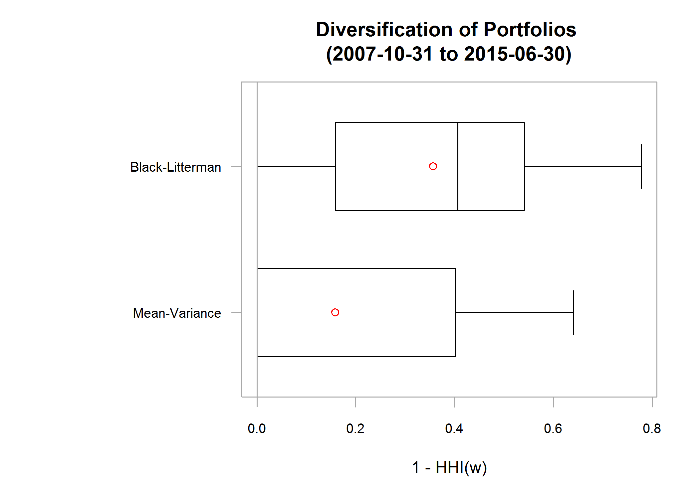
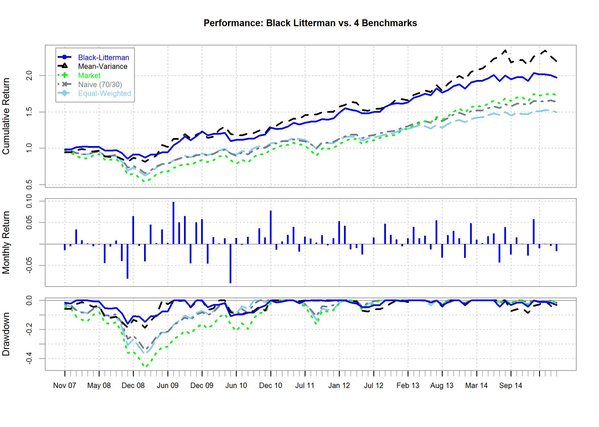

Introduction
--

I recently allocated a significant portion of my retirement funds with Betterment, a technology-driven investment management company (some might still call it a start-up) that has been making waves in the finance industry with its product offering. Betterment offers a sophisticated, theoretically sound, cost-effective and fully automated platform for money management that is intended for the broader public, not just high net worth individuals. My decision to allocate funds to Betterment resulted mainly from the lack of solutions out there for automatically rebalancing dynamically optimized portfolios. Given that I am also a quantitative finance geek of sorts, I also was looking for a company that was offering a "set it and forget it" solution with a thoughtful approach to modern portfolio optimization. Target date funds offered by larger retail investment outfits (e.g., Fidelity) did not really fit the bill for me. I will let the great research done by the folks at Betterment speak further to this point. For more information on Betterment please see <https://www.betterment.com/>.

Betterment employs a Black-Litterman (BL) based approach to portfolio optimization. I wanted to focus on getting a better understanding of the benefits of applying BL portfolio optimization to the specific ETFs in the Betterment portfolio[^1]. Note that for this analysis, I only used the ETFs for which I could get data going back to before the Great Financial Crisis (GFC) of 2008-2009. Thus, dynamic portfolio optimization was applied to only 9 out of the 12 ETFs in the Betterment portfolio[^2].
 
[^1]: Other key components of the Betterment approach such as the distribution of performance statistics based on Monte Carlo simulation and tax efficiency are not considered.  
 
[^2]: More specifically, I incorporate equity markets exposure through VTI, VTV, VOE, VBR, VEA and VWO as well as bond exposure through LQD, AGG and TIP.   

The analysis and backtested results presented here confirm that Black-Litterman based optimization, when compared against a standard Mean-Variance (MV), i.e., Markowitz approach, leads to portfolios that have: 1) more intuitive weights, 2)a tendency towards more diverse asset allocations, and 3)a tendency towards increased robustness. I also compare performance of the BL portfolio to that of an MV portfolio and include comparisons to an equal-weigthed portfolio, naive portfolio (70% stocks (VTI) and 30% bonds (AGG)), and the market (VTI) for completeness.

Some Theory and Assumptions
--
One of the major strengths of BL is that it starts with economically intuitive assumptions by leaning on CAPM. CAPM assumes that all investors are mean-variance optimizers, have the same holding period for investments, use the same exact inputs (i.e., expected returns and covariances) for portfolio optimization, and are not subject to transaction costs and other frictions to trading. As a result of these assumptions, all investors reach their optimal allocation to risky assets by simply holding the market portfolio. 

BL therefore starts with the market equilibrium based on CAPM when estimating the expected returns of the assets in the portfolio. If the portfolio manager has access to the market capitalization weights of these assets, she can reverse engineer the expected returns given the optimal solution (i.e., the portfolio weights) that maximizes the constrained Quadratic Utility(QU) function[^3]. Alternatively, if the market cap weights are unavailable, the portfolio manager can apply CAPM directly in order to estimate the expected returns. Another key advantage with BL is that it allows the manager to deviate from market equilibrium by imposing her own views on how specific assets will perform in terms of absolute returns or relative to other assets in the portfolio.  The technical details underlying the BL approach presented here can be found in the Appendix (yet to be completed)[^4].           

[^3]: I also had to assume a risk aversion level of 3 when optimizing the portfolio (i.e., maximizing the QU function). This is the risk aversion level of a typical market participant as estimated in Ang (2014), section 3.3 (location 1267 if you're a Kindle reader).

[^4]: Note that I also impose long-only and full investment constraints on the portfolio optimization problem in order to better approximate a real world application. 

For the purposes of this analysis and for simplicity, I do not incorporate views that deviate from the market equilibrium. Expected returns are calculated only based on CAPM. Without any views imposed, the weights returned by the optimizer theoretically match the market weights. Regardless, we should expect better allocation diversity in a BL portfolio when compared against an MV portfolio over the same rebalancing period. BL optimized portfolios also tend to be more robust. We illustrate these results in the sections that follow.    

Diversification Benefits
--

I first present the improved diversification by way of a specific example (for the rebalancing period of 2009-07-31 in particular). Figure 1 shows that for the rebalancing period of 2009-07-31, the MV portfolio is subtantially more concentrated (and therefore less diverse) than the BL portfolio. 


**Figure 1. Portfolio Allocations: BL vs. MV**


How do portfolio weights compare over time and can we assess whether BL portfolios tend to be more diverse? We can answer this question by calculating the Herfindahl Hirschman Index (HHI) at each point in time. To be more precise, if ${N}$ is the number of assets in the portfolio and $$\pmb{w}=\begin{pmatrix} w_{1} & w_{2} & \cdots & w_{N}\end{pmatrix}^T$$ is the ${N}x1$ vector of portfolio weights, then $$HHI(\pmb{w})=\displaystyle\sum_{i=1}^{N} w_i^2$$ is simply the sum of the squared portfolio weights at each point in time. The higher $HHI(\pmb{w})$, the more concentrated the portfolio. By calculating $1-HHI(\pmb{w})$ at each point in time, we get a time series that gauges the diversification of the portfolio. Given monthly portfolio rebalancing (as assumed throughout the analysis) over the period 2007-10-31 through 2015-06-30, we can illustrate the distribution of diversification measures over time for both BL and MV portfolios as shown in the box plots of Figure 2.


**Figure 2. Diversification Over Time: BL vs. MV**

Indeed, BL portfolios tend to be more diverse. Median and mean diversification measures over the period for BL portfolios are 0.36 and 0.41, respectively. In contrast, MV portfolios have a mean diversification measure of 0.16 and a median of very close to 0. Given a median of effectively 0, half of the observations (that fall short of the median) are even closer to 0 and we therefore have a portfolio that is solely concentrated in one asset at least half of the time.

Robustness
--

In the works

Performance
--

Performance summaries for BL and MV portfolios are shown in Table 1 and presented in a more visual way in Figure 3. At first glance, dynamic portfolio optimization (with monthly rebalancing) seems to have its benefits as MV and BL portfolios outperform the market, naive and equal-weighted portfolios in both absolute and risk-adjusted terms.
Backtested BL and MV portfolios post the highest Geometric mean returns (GeomMean), Sharpe Ratios (SR)[^5], and STARR ratios (STARR) while also achieving the lowest drawdowns.   

**Table 1. Performance Summary: BL vs. MV and Other Benchmarks**[^6] 
**(Nov 2007 to June 2015)**
```{r, echo=FALSE}
print(perf.tbl[,1:3])
print(perf.tbl[,c(1,2,4,5)])
```

 
**Figure 3. Performance Summary: BL vs. MV and Other Benchmarks** 

[^5]: I also show the Sharpe Ratio standard error (SR.se) based on the formula derived by Mertens (2002). 

[^6]: Absolute and risk-adjusted returns measures are expressed on an annualized basis. Backtested BL and MV portfolios are rebalanced monthly. Transaction costs are not accounted for.  

More to add

Caveats
--

There are a number of real world elements that I do not account for in the performance analysis:

* I do not account for transaction costs and the performance of the BL and MV portfolios is therefore overstated especially since turnover for these portfolios can often times be high.

More to add 